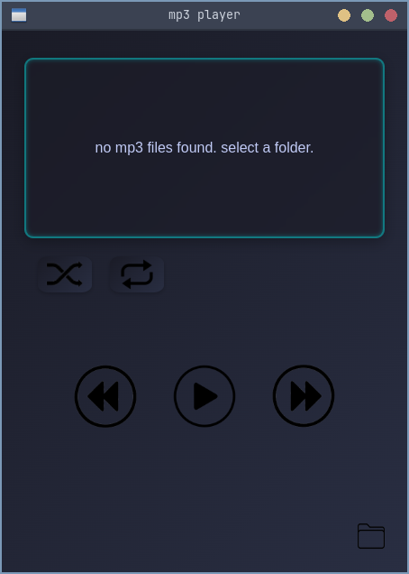

# 🎵 Simple MP3 Player

A lightweight MP3 player built with **Python** using **PyWebview** for the backend and **HTML/CSS/JavaScript** for the frontend. Designed to be minimal and easy to use — just open a folder and start listening to your MP3 collection.

  

---

## 💠 Features

- Play, pause, and switch tracks
- Previous and next track navigation
- Shuffle and repeat modes
- Simple, clean UI
- Cross-platform via PyWebview

---

## 📆 Requirements

- Python 3.7+
- pip (Python package manager)

### Python Packages

```bash
pip install pygame pywebview
```

---

## 🚀 How to Run

1. Clone the repo:

```bash
git https://github.com/notme6000/python-mp3-player.git
cd python-mp3-player
```

2. Run the app:

```bash
python app.py
```

3. Select a folder with `.mp3` files using the folder button and enjoy!

---

## 📁 Folder Structure

```
simple-mp3-player/
│
├── static/
│   ├── ui.html        # Frontend UI
│   ├── style.css      # Styling
│   ├── script.js      # JS logic
│   ├── play.png       # Play icon
│   ├── pause.png      # Pause icon
│   └── config.json    # Saved music directory
│
├── app.py             # Python backend with PyWebview
└── README.md          # This file
```

---

## 📜 License

This project is licensed under the **GNU General Public License (GPL)**.


